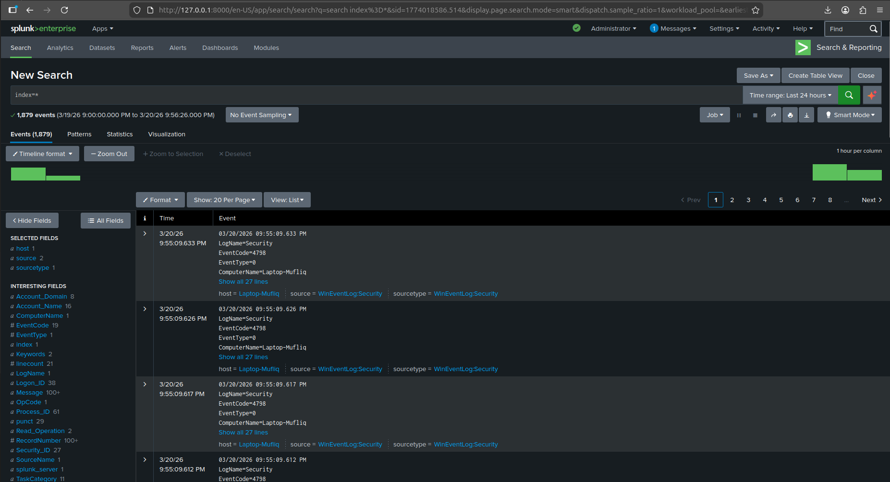
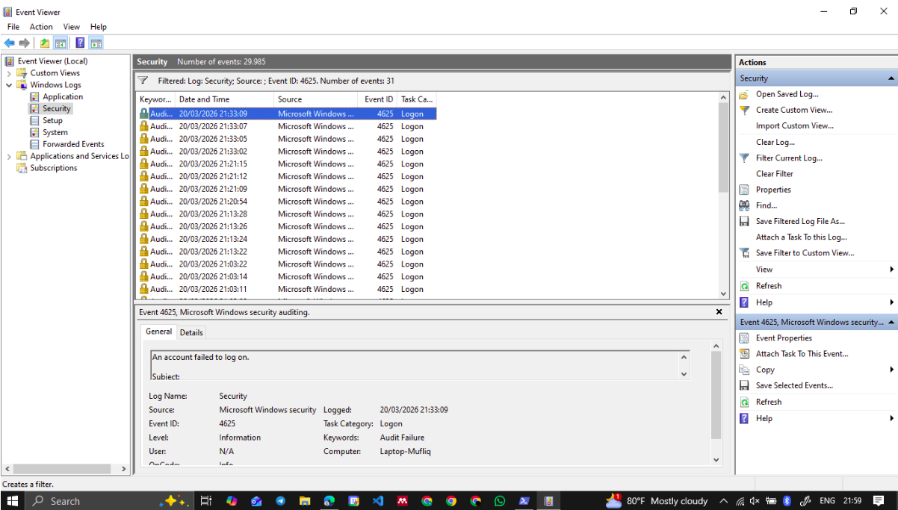
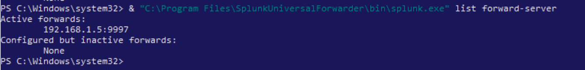
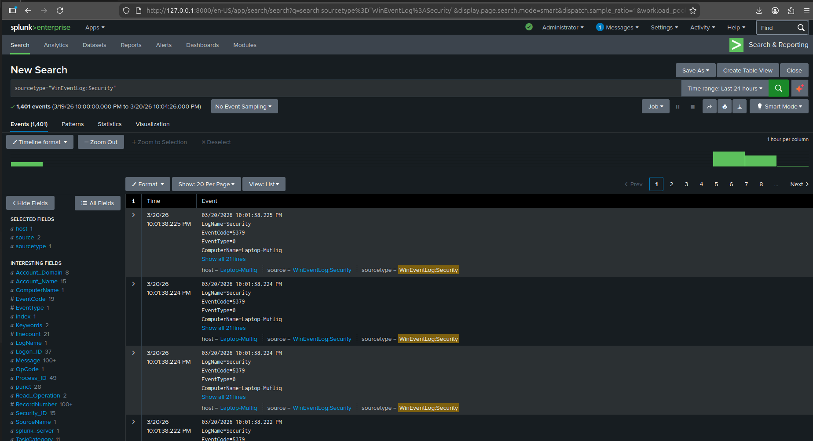
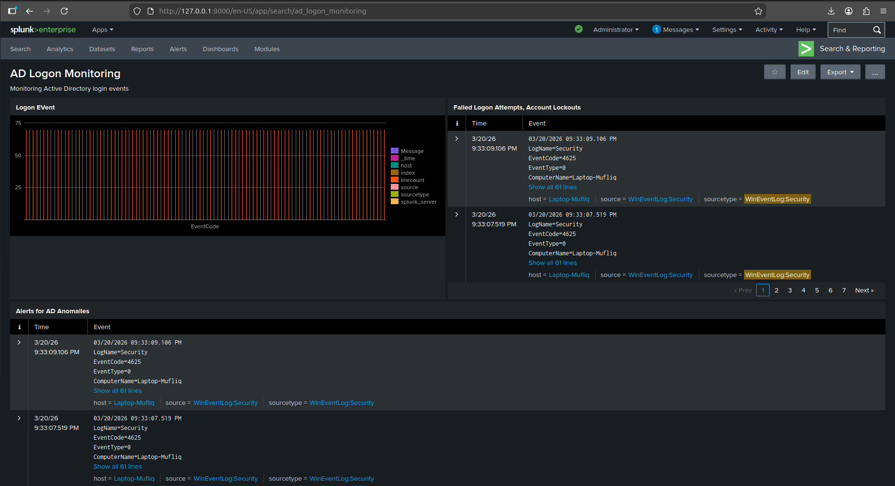
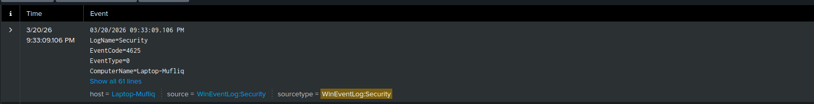
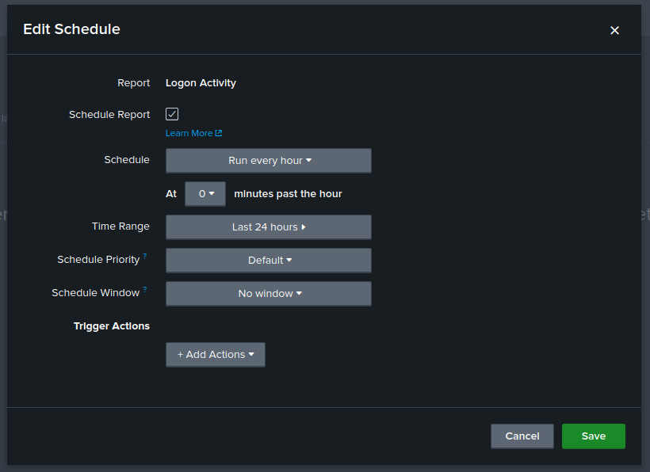

# Active Directory Monitoring with Splunk

## 📌 Objective

This project aims to build a Security Information and Event Management (SIEM) lab using Splunk to monitor Active Directory (AD) authentication activities. The objective is to collect Windows Security logs, analyze login behavior, detect suspicious activities such as brute-force attempts, and generate alerts and reports for security monitoring.

---

## 🧠 Skills Learned

* Log ingestion and forwarding using Splunk Universal Forwarder
* Windows Security Event analysis (Event ID 4624 & 4625)
* Detection of failed logon and brute-force patterns
* Building dashboards for security monitoring
* Creating alerts for anomaly detection
* Generating scheduled reports in Splunk

---

## 🛠️ Tools Used

* Splunk Enterprise
* Splunk Universal Forwarder
* Windows Event Viewer
* Active Directory / Windows Machine
* PowerShell
* Ubuntu (Splunk Server)

---

## 🚀 Steps

### Step 1: Splunk Installation and Setup

Installed Splunk Enterprise on the server and ensured the service was running properly. Configured Splunk to receive data from forwarders.



---

### Step 2: Generate Windows Security Logs

Performed failed login attempts on the Windows machine to generate Event ID **4625** logs.



---

### Step 3: Configure Universal Forwarder

Configured Splunk Universal Forwarder to collect Windows Security logs using `inputs.conf`.

```ini
[WinEventLog://Security]
disabled = 0
```



---

### Step 4: Verify Log Ingestion in Splunk

Validated that logs were successfully ingested into Splunk using the following search:

```spl
sourcetype="WinEventLog:Security" EventCode=4625
```


---

### Step 5: Create AD Logon Monitoring Dashboard

Created a dashboard to visualize login activity and failed login attempts.



---

### Step 6: Detect Brute Force Login Attempts

Created a detection query to identify suspicious login attempts:

```spl
sourcetype="WinEventLog:Security" EventCode=4625
| stats count by Account_Name
| where count > 5
```



---

### Step 7: Configure Alert for Anomalies

Converted the detection query into an alert to notify when suspicious activity occurs.

* Condition: count > 5
* Time Range: Last 10 minutes
* Trigger: Every 5 minutes

---

### Step 8: Generate Scheduled Reports

Created scheduled reports for monitoring AD activity trends over time.



---

## 🔍 Queries Used

### Failed Logon Detection

```spl
index=main sourcetype="WinEventLog:Security" EventCode=4625
| stats count by Account_Name, host
| sort - count
```

### Brute Force Detection

```spl
index=main sourcetype="WinEventLog:Security" EventCode=4625
| bin _time span=5m
| stats count by _time, Account_Name, host
| where count >= 5
| sort - count
```

---

## ⚙️ Configuration

### inputs.conf

```ini
[WinEventLog://Security]
disabled = 0
```

---

## 📊 Project Outcome

This project successfully demonstrates an end-to-end SIEM pipeline:

* Log generation from Windows
* Log forwarding using Splunk Universal Forwarder
* Log ingestion into Splunk
* Data analysis using SPL queries
* Visualization through dashboards
* Detection using alerts
* Reporting for continuous monitoring

The lab simulates real-world SOC scenarios, particularly brute-force attack detection, making it highly relevant for cybersecurity roles.

---

## 🚀 Key Takeaways

* Understanding how SIEM pipelines work in real environments
* Importance of log sources and data accuracy
* Detecting authentication-based attacks
* Building practical security monitoring solutions

---
